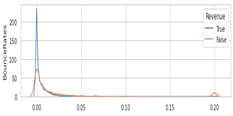

# Online-Shopper-Intention
This case study used online shopper intention datasets to predict the visitors of online platforms are likely to increase the revenue.
I have tried to perform EDA through various visualizations and feature selection This case study also implements Logistic Regression, Decision Tree, and Random Forest algorithms to determine visitors of online platforms are likely to increase the revenue

## EDA

## Pre-Processing
### Treat the imbalance data using SMOTE

### Feature Selection
* Chi-square Test
The Chi-square test is used in statistics to test the independence of two events.
* Multicollinearity Test 
The VIF is widely used as a measure of the degree of multi-collinearity of the independent variable with the other independent variables in a model.

## Model Building   

The methods used to predict online shopper’s purchasing intention in this project are binary logistic regression, decision tree, and random forest with evaluation methods are 5 and 10-fold cross validation. I tried three different models and evaluated them using Accuracy and AUC.

## Model performance

